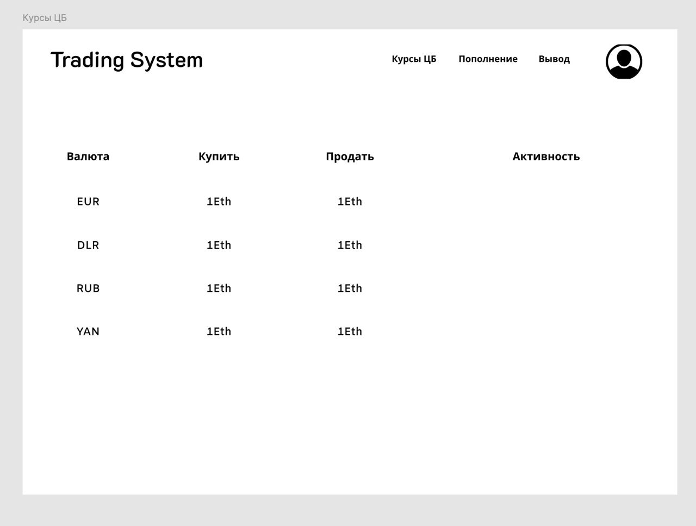
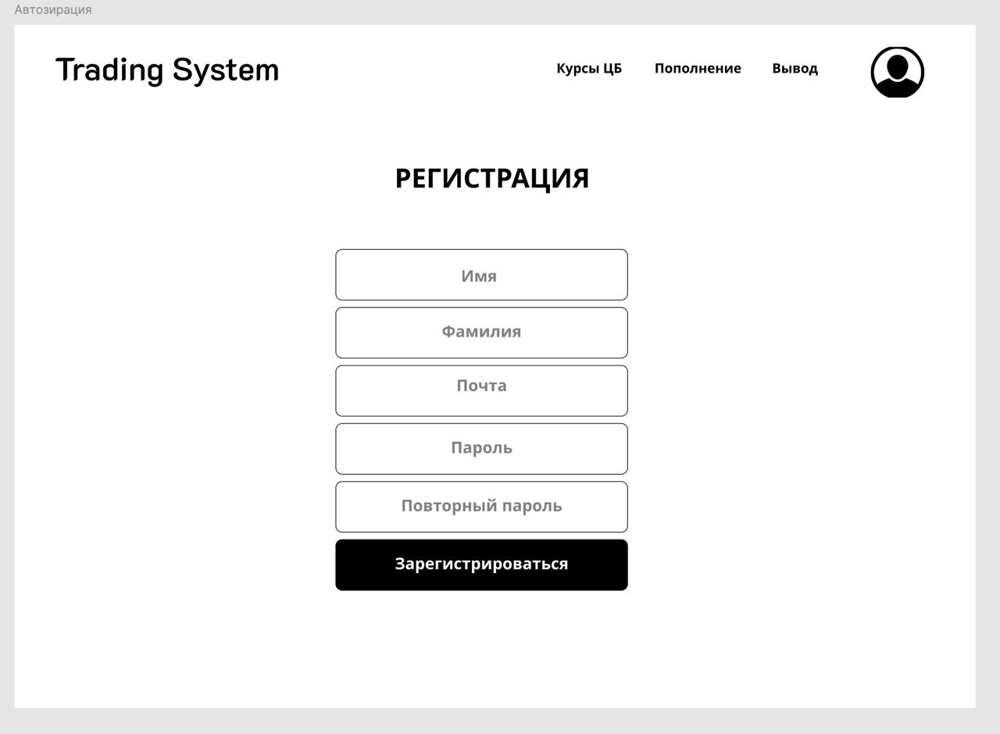

Итоговое домашнее задание по курсу "Проектирование и разработка децентрализованных приложений" от студентов Зиганшина Алима и Хасанова Анвар

# Trading System

## Фронтенд

Для разработки фронтенда был использован фреймворк React JS. На странице присутствуют следующие компоненты:

1. Регистрация пользователя
2. Курсы ЦБ
3. Пополнение средств
4. Вывод средств
5. Личный аккаунт пользователя с историей операций и балансом

Все это выглядит следующим образом:

(Это фотографии макета, в продакшене подцепляется настоящий курс с сайта ЦБ РФ с помощью их api)

Также мы хотим реализовать график динамики цен.

## Бэкенд

Разработан на языке Solidity, содержит следующие контракты:

1. Wallet - кошелек, с возможностью пополнения баланса и исползования средств (для снятия или покупи валют)
2. WalletFactory - контракт для заведения кошельков, а также получения информации о кошельке владельцем
3. AssetTypes - enum с используемыми валютами
4. Trade - контракт с основной бизнес-логикой обмена валют. Из Chainlink получает курс валют, далее в соответствии с ним уменьшает баланс кошелька, увеличивая одно из полей валюты или металла (или наоборот)
